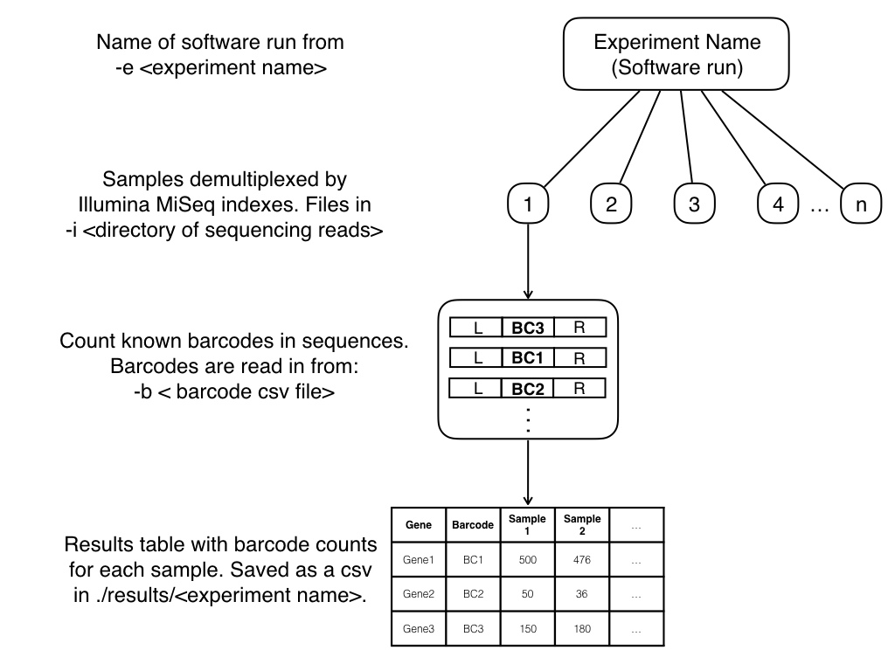

[


# barseq 

Python package for analyzing barseq data.

### Installation

```bash
pip install git+https://github.com/mjmlab/barseq.git@master
``` 

### Usage

```bash
barseq -i <directory of sequencing reads> -b <barcode file> -e <experiment name>
```

`-i` / `--input`

- Directory with Illumina reads in either fastq or fastq.gz.


`-b` / `--barcodes`

- CSV file with barcode and correspondent gene names.


`-e` / `--experiment`

- Name of experiment, it is used for creating results folder.

### Files Needed

**Directory of Illumina reads [`-i`]** for analyzing. Can be either fastq or fastq.gz format

```text
@M06026:87:000000000-D69HY:1:1102:15909:1336 1:N:0:TGACCA
CTCTAGAAAGTATAGGAACTTCAGGGCCATTTATATACCTTCCACTCTTCAACCGTGTCTTGACTTGACCTGGATGTCTCTACTGCTGTCATGCTACGTAGCTCATGCTACGTCGATCTAGTCGATGCATGCTAGCTGATCGACTCTCTTC
+
A#>>>3AA2DD>FBFGBFBFBFDDFGGAAEEEHDHFFFDDDBDGDFDDDDDADFGFFDDBFFEBFD5DFEEBBADABFGFGBBFGDD5BF3F43B3F1/11B144BGEBF@BBFB0B0BBFBBBBBBBB?E/FGFBB?/???B???/?FGG
```

**Barcode file [`-b`]** with gene names. Needs to be in CSV format.

```text
Barcode,Gene
ATGAAGACTGTTGCCGTA,WT
CACGACGCCCTCCGCGGA,gene1
ACTATTACGCAAAATAAT,gene2
ATGGAAGATATTATTATT,gene3
CCTCTCCAACCGGGTCTG,gene4
CCCGGTCGCCTAGCCCCG,gene5
GGCCCCCCGCCCGTCCCC,gene6
GGATCACTGCTAGCGTAT,gene7
CCTGCAGCAGCGGCCCGC,gene8
ACACATGCAGACATAGAG,gene9
CGCGCCATCCGCCGCCCA,gene10
AATATTCAGATGGGACGT,gene11
```

### Output

#### `results/` directory

- <experiment>_results.csv: barcode counts found in each sequence file.


| Gene |       Barcode        | Sample 1 | Sample 2 | Sample 3 | ... |
| ---- | -------------------- | --------:| --------:| --------:| --- |
| gene1| `ATGAAGACTGTTGCCGTA` |    500   |    5     |     7    | ... |
| gene2| `CACGACGCCCTCCGCGGA` |     12   |   13     |    19    | ... |
| gene3| `ACTATTACGCAAAATAAT` |     13   |   11     |    10    | ... |
|_other|        _other        |     28   |   40     |    29    | ... |


### Barseq Workflow



